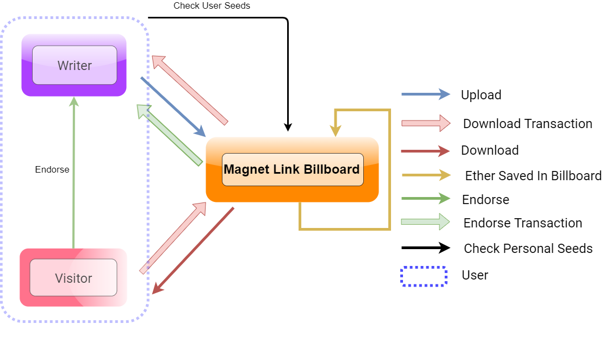
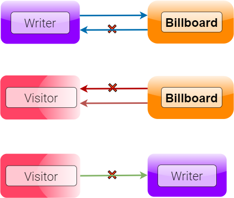

# Magnet Link Billboard


## Authors
* Mingyuan Du &nbsp; * Zijun Wang &nbsp; * Yuhang Xiao &nbsp; * Zhaosheng Li

## Table of contents

- [Description](#Description)
- [Architecture diagram](#Architecture-diagram)
- [Constraints](#Constraints)
- [Files in this repo](#Files-in-this-repo)
- [Front-end URL](#Front-end-URL)
- [Running the code](#Running-the-code)

## Description

This project is about building a decentralized application (DApp). The DApp we propose to create is magnet link billboard, which is a peer-to-peer (P2P) platform that encourages users to share documents without worrying about centralized authority and the location of original files. Each document on the platform is considered as a seed. The user can act as a writer and contribute to the DApp by uploading seeds. Also, the user can become a visitor to the platform by browsing, downloading, or endorsing the seeds on the billboard. The back-end of this work is a smart contract, which guarantees the trustworthy transactions of digital assets and constraints some operations on the online platform.

## Architecture diagram
This image illustrates the business logic defined by the smart contract at back-end



## Constraints
Our smart contrat defines the following contraints on this DApp:

- A user shall not download the seeds that are uploaded by himself/hersel
- A user shall download every single seed only for once
- A user shall only endorse the seeds he/she has already downloaded



## Files in this repo

This GitHub repo contains the following folders or files

+ `migrations` folder contains migration files when delploying the smart contract

+ `img` folder contains some relevant images for this project

+ `src` folder contains the smart contract code react components code

+ `test` folder contains the test code for smart contract and some react components

+ `package.json` and `package-lock.json` list out all the dependencies for this DApp

+ `truffle-config.js` is the file when we configure a truffle project at the beginning stage of this work

+ `Project_Report.pdf` is the report of this project, which contains a specific user workflow

+ `sample_data.txt` is a test seed transmitted to the DApp

## Front-end URL
https://www.magnetlinkbillboard.com/
   
***NOTE 1: A MetaMask account is required when using this DApp***

***NOTE 2: The frontend interface only indicates the basic information of seeds except the link. If one wants to acquire the link, he/she needs to click the `Download` button and has enough amount of ether, unless the seed is for free***

## Running the code
1. Clone this repo to your local machine

```bash
git clone https://github.com/zhaoshengEE/Magnet_Link_Billboard.git
```

2. Open the repo with Visual Studio Code, IntelliJ, or other IDE

3. Delete the two `.json` files in `src/abis`

4. Run the following command on the command line of IDE

```bash
truffle migrate --network rinkeby
```
